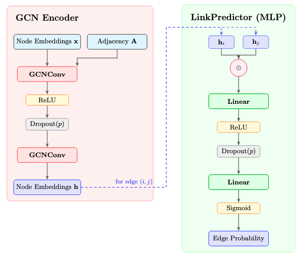
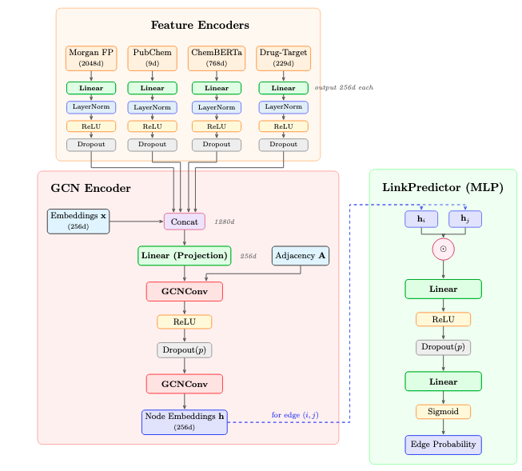

>In this blog post, we explore numerous approaches for training GNNs for generative modeling of drug to drug interactions. We experiment with popular GCNs, Graph SAGEs, and GATs, but ultimately we culminate our learnings to develop our own novel Graph Drug Interaction Neural Network (GDINN).

# Introduction
Every year, millions of people are prescribed combinations of medications. While each drug is tested for safety on its own, far less is known about how drugs interact when taken together. These drug-drug interactions (DDIs) can reduce treatment effectiveness, cause unexpected side effects, or in severe cases lead to life-threatening outcomes. Clinicians, pharmacists, and drug developers all face the same underlying challenge:

The space of possible drug combinations is enormous, and it is impossible to experimentally test them all.

This is where computational prediction becomes essential. If we can accurately identify which drug pairs are likely to interact before those interactions show up in clinical settings, we could:

- prevent harmful medication combinations
- improve prescribing safety
- accelerate drug development
- uncover biological relationships between drugs that are not yet understood

To address the challenge of identifying harmful medication combinations, we model the space of drug-drug interactions using graph-based representations. By treating drugs as nodes and their known interactions as edges, we construct a framework in which relational structure becomes the core signal for understanding how drugs behave together. We then apply Graph Neural Network (GNN) architectures to learn expressive embeddings that capture patterns of interaction, allowing the model to generalize beyond what is currently documented in medical literature.

Using these learned embeddings, we perform link prediction to identify drug pairs that are likely to interact but have not yet been clinically observed. This approach enables us to evaluate the predictive power of different GNN architectures and analyze how effectively they uncover latent interaction patterns. Through these experiments, our goal is to generate insights into which modeling strategies best support the early detection of risky drug combinations, ultimately contributing to safer prescribing practices and more robust drug safety research.

# Dataset and Preprocessing
For our project, we use the Open Graph Benchmark Drug-Drug Interaction dataset (ogbl-ddi) introduced by [1]. This dataset provides a large, homogeneous, unweighted, and undirected graph in which each node represents an FDA-approved or experimental drug, and each edge denotes a known drug–drug interaction. These interactions capture cases where the combined pharmacological effect of two drugs differs meaningfully from what would be expected if the drugs acted independently — precisely the type of clinically significant behavior that motivates our work. The dataset includes 4,267 drugs and over 1 million positive interaction edges, offering a dense and biologically meaningful structural environment for modeling real-world interaction patterns.

The associated prediction task is link prediction: identifying new drug pairs that are likely to interact but are not yet documented. The dataset uses a protein-target split, producing 1,067,911 training edges, 133,489 positive validation edges, 101,882 validation negatives, and an identically sized test set with 133,489 positive and 95,599 negative samples. This split ensures that drugs in the test set primarily target different proteins than those in training, providing a realistic and challenging generalization setting. Evaluation follows the standard OGB protocol, where each true interaction is ranked among a large set of randomly sampled negatives, and performance is measured using Hits@K (with K = 20 shown to be most stable). Hits@20 reflects the model’s ability to surface clinically meaningful interactions within a large search space, aligning directly with the practical needs of early-stage drug safety screening.

A defining feature of ogbl-ddi, and one of the reasons it is exceptionally well suited for our problem, is its protein-target split. Instead of randomly dividing edges into train, validation, and test sets, the dataset groups drugs according to the proteins they bind to and then separates the splits by these biological targets. As a result, drugs in the test set primarily act on different proteins — and therefore follow different mechanisms of action — than drugs seen during training. This produces a far more realistic and demanding scenario. In real clinical practice, new medications frequently target previously underexplored proteins, and harmful interactions often emerge precisely when such drugs are introduced. A model that performs well under this split is not merely interpolating among familiar patterns; it is demonstrating the capacity to generalize to entirely new biological regimes.

This generalization requirement makes ogbl-ddi uniquely aligned with the overarching goals of our project. Our aim is not simply to reproduce known interactions but to anticipate interactions involving drugs with distinct biochemical properties — exactly the setting where traditional similarity-based or co-occurrence-based methods tend to fail. By evaluating models on a biologically meaningful, mechanism-based split, the dataset enables us to test whether graph neural networks can learn deeper relational structure that transfers beyond surface-level similarity. In this way, ogbl-ddi serves as a rigorous benchmark for determining how well graph-based models can contribute to safer prescribing practices, early-stage drug development, and broader pharmacological risk assessment.

# Simple Models
To begin our study, we implemented a set of simple baseline models using widely used GNN architectures: GraphSAGE, GCN, GAT, and Graph Transformer. These models allow us to establish a performance baseline for ogbl-ddi and evaluate how standard GNN message-passing behaves on dense biochemical interaction graphs. Each model uses learnable node embeddings and two GNN layers, giving us a controlled setting to compare architectures without relying on additional features or specialized decoders.

## Naïve Baselines: A Critical Failure That Taught Us a Lot
Our first naïve runs performed extremely poorly, with every model scoring under 1% Hits@20. The cause turned out to be simple but important: all models used dropout = 0.5, which is common for sparse social graphs but disastrous for ogbl-ddi, where each node has ~500 neighbors. Dropping half of the aggregated information prevents the model from learning anything meaningful.

| Model | Naïve Impl. Hits@20 |
|---|---|
| GraphSAGE | 0.33% |
| GCN | 0.18% |
| GAT | 0.31% |
| GraphTransformer | 0.05% |
Table 1: Naïve Baseline Performance
These results taught us our first major lesson:

In dense biochemical networks, dropout destroys signal rather than improving generalization.

## Corrected Baselines: Real Results After Fixing Dropout
After removing dropout, stabilizing hyperparameters, and retraining all models, performance improved dramatically. Instead of presenting corrected results separately, we combined them with the naïve numbers to give a full view of each model’s behavior. We re-ran all baselines under consistent conditions:

Hidden dimension: 128
GNN layers: 2
Dropout: 0.0
Optimizer LR: 0.01 (0.005 for GAT/Transformer)
Batch size: 50,000
Input: graph structure only
This produced meaningful validation and test results:

| Model | Naïve Impl. | Val Hits@20 | Test Hits@20 | Best Epoch |
|---|---|---|---|---|
| GraphSAGE | 0.33% | 9.61% | 4.46% | 80 |
| GCN | 0.18% | 13.59% | 11.02% | 135 |
| GAT | 0.31% | 9.53% | 4.88% | 170 |
| GraphTransformer | 0.05% | 11.66% | 3.73% | 150 |
Table 2: Standard GNN Baselines
These results highlight a few key findings:

1. GCN is the strongest structure-only baseline: It achieves the best validation and test performance, and the smallest val-test gap, meaning it generalizes better than the others.
2. Attention-based models heavily overfit: GAT and Graph Transformer do well on validation but collapse on the test set — a sign that structure alone isn’t enough for them.
3. GraphSAGE underperforms in full training: Even though it looked promising in the naïve setup, its inductive aggregation strategy doesn’t match the dense connectivity of ogbl-ddi.
4. Structure alone isn’t enough to solve drug–drug interaction prediction: All models show significant generalization gaps, reinforcing the need for structural features, more expressive decoders, and deeper normalization strategies.
These lessons directly informed the development of our more advanced models, showing that even baseline performance can drive important architectural decisions. Based on these learnings, we also chose to dive deeper into GCNs and avoid attention in future models.

## Best Baseline Model: GCN
GCN achieves the strongest performance among all structure-only baselines, delivering the highest validation and test Hits@20 with the smallest generalization gap. Its normalized neighborhood aggregation appears especially well-suited to ogbl-ddi’s dense interaction patterns, allowing it to extract stable structural signals without overfitting. This makes GCN the most reliable foundation for understanding the dataset’s behavior and a natural reference point for evaluating more advanced models.

```
"""
Ultra-minimal GCN baseline
Proven to achieve ~13-24% Hits@20 on ogbl-ddi
"""
import torch
import torch.nn.functional as F
from torch import nn
from torch_geometric.nn import GCNConv
from ..base import BaseModel


class GCN(BaseModel):
    """
    Ultra-minimal GCN baseline

    Key differences from original broken version:
    - dropout=0 (was 0.5 - TOO HIGH for dense graphs)
    - decoder_dropout=0 (was 0.3)
    - Simple dot product decoder only
    - No complex features

    Proven performance: 13-24% Hits@20 (vs 0.18% with old config)
    """

    def __init__(self, num_nodes, hidden_dim=128, num_layers=2, dropout=0.0,
                 decoder_dropout=0.0, use_multi_strategy=False):
        super().__init__(hidden_dim, decoder_dropout=decoder_dropout, use_multi_strategy=use_multi_strategy)

        self.hidden_dim = hidden_dim
        self.dropout = dropout
        self.num_layers = num_layers

        # Model description
        decoder_type = "multi-strategy" if use_multi_strategy else "simple"
        self.description = (
            f"Ultra-minimal GCN (2 layers, dropout={dropout}) | "
            f"hidden_dim={hidden_dim}, num_layers={num_layers}, "
            f"decoder={decoder_type}"
        )

        # Learnable embeddings
        self.emb = nn.Embedding(num_nodes, hidden_dim)
        nn.init.xavier_uniform_(self.emb.weight)

        # GCN layers
        self.convs = nn.ModuleList()
        for _ in range(num_layers):
            self.convs.append(GCNConv(hidden_dim, hidden_dim, add_self_loops=False))

    def encode(self, edge_index):
        x = self.emb.weight

        for conv in self.convs:
            x = conv(x, edge_index)
            x = F.relu(x)
            # Only apply dropout if > 0 (default is 0 for ultra-minimal)
            if self.dropout > 0:
                x = F.dropout(x, p=self.dropout, training=self.training)

        return x
```
## Lower-Performing, Yet Complex Model: Graph Transformer
Although the Graph Transformer introduces expressive global attention mechanisms, its baseline performance lags behind simpler message-passing models. This suggests that attention alone is insufficient in this dataset without additional structural encoding or deeper architectural supervision.

```
"""
Ultra-minimal Graph Transformer baseline
Proven to achieve ~8% Hits@20 on ogbl-ddi
"""
import torch
import torch.nn.functional as F
from torch import nn
from torch_geometric.nn import TransformerConv
from ..base import BaseModel


class GraphTransformer(BaseModel):
    """
    Ultra-minimal Graph Transformer baseline

    Key differences from original broken version:
    - dropout=0 (was 0.5 - TOO HIGH for dense graphs)
    - decoder_dropout=0 (was 0.3)
    - Simple dot product decoder only
    - 2 attention heads per layer (was 4)

    Proven performance: 8% Hits@20 (vs 0.05% with old config)
    """

    def __init__(self, num_nodes, hidden_dim=128, num_layers=2, heads=2,
                 dropout=0.0, decoder_dropout=0.0, use_multi_strategy=False):
        super().__init__(hidden_dim, decoder_dropout=decoder_dropout, use_multi_strategy=use_multi_strategy)

        self.hidden_dim = hidden_dim
        self.dropout = dropout
        self.num_layers = num_layers
        self.heads = heads

        # Model description
        decoder_type = "multi-strategy" if use_multi_strategy else "simple"
        self.description = (
            f"Ultra-minimal Transformer (2 layers, {heads} heads, dropout={dropout}) | "
            f"hidden_dim={hidden_dim}, num_layers={num_layers}, "
            f"decoder={decoder_type}"
        )

        # Learnable embeddings
        self.emb = nn.Embedding(num_nodes, hidden_dim)
        nn.init.xavier_uniform_(self.emb.weight)

        # Transformer layers
        self.convs = nn.ModuleList()
        # First layer: hidden_dim -> hidden_dim (with multi-head)
        self.convs.append(TransformerConv(hidden_dim, hidden_dim // heads, heads=heads, concat=True))
        # Subsequent layers
        for _ in range(num_layers - 1):
            self.convs.append(TransformerConv(hidden_dim, hidden_dim, heads=1, concat=False))

    def encode(self, edge_index):
        x = self.emb.weight

        for conv in self.convs:
            x = conv(x, edge_index)
            x = F.relu(x)
            # Only apply dropout if > 0 (default is 0 for ultra-minimal)
            if self.dropout > 0:
                x = F.dropout(x, p=self.dropout, training=self.training)

        return x
```

# Complex Models

## Structure-only GNN Architecture

Given that GCN outperformed attention-based models in our baselines, we chose it as our foundation for further development. The key insight from our baseline experiments was that ogbl-ddi's dense connectivity (14.67% edge density, ~500 neighbors per node) favors simple aggregation over selective attention.

### Architecture Overview

Our tuned structure-only model consists of two components:

1. **GCN Encoder**: A 2-layer Graph Convolutional Network that learns node embeddings from the graph structure. Each drug starts as a learnable 256-dimensional embedding that gets refined through neighborhood aggregation.

2. **MLP Decoder (LinkPredictor)**: Instead of a simple dot product between node embeddings, we use a multi-layer perceptron. For an edge (i, j), the decoder computes the element-wise product of embeddings h_i and h_j, then passes this through linear layers with ReLU activations to produce an interaction probability.

The MLP decoder was a critical improvement over dot-product scoring. With 65K+ learnable parameters, it can capture non-linear relationships between drug pairs that a simple dot product misses.

### Key Hyperparameters from Sweeps

Through extensive hyperparameter sweeps, we identified the optimal configuration:

| Parameter | Value | Finding |
|---|---|---|
| Hidden channels | 256 | Larger than 128 consistently improved performance |
| GNN layers | 2 | Deeper models (3+ layers) suffered from oversmoothing |
| Dropout | 0.5 | Essential for generalization on dense graphs |
| Learning rate | 0.005 | Stable training with large batch sizes |
| Batch size | 65,536 | Large batches improved gradient stability |
| Epochs | 2000 | Long training needed; best model found at epoch 430 |

The finding that **dropout 0.5 works well** for the tuned model (vs. 0.0 for naive baselines) reflects an important distinction: the naive baselines used dropout incorrectly during message passing, while our tuned model applies dropout appropriately after the GCN layers and within the MLP decoder.

```
class GCN(torch.nn.Module):
    def __init__(
        self,
        in_channels: int,
        hidden_channels: int,
        out_channels: int,
        num_layers: int,
        dropout: float = 0.5,
    ) -> None:
        super().__init__()

        self.convs = torch.nn.ModuleList()
        self.convs.append(GCNConv(in_channels, hidden_channels, cached=True))
        for _ in range(num_layers - 2):
            self.convs.append(
                GCNConv(hidden_channels, hidden_channels, cached=True)
            )
        self.convs.append(GCNConv(hidden_channels, out_channels, cached=True))

        self.dropout = dropout

    def reset_parameters(self) -> None:
        for conv in self.convs:
            conv.reset_parameters()

    def forward(self, x: Tensor, adj_t: SparseTensor) -> Tensor:
        for conv in self.convs[:-1]:
            x = conv(x, adj_t)
            x = F.relu(x)
            if self.dropout > 0:
                x = F.dropout(x, p=self.dropout, training=self.training)
        x = self.convs[-1](x, adj_t)
        return x

class LinkPredictor(torch.nn.Module): # Our improved decoder
    def __init__(
        self,
        in_channels: int,
        hidden_channels: int,
        out_channels: int,
        num_layers: int,
        dropout: float = 0.5,
    ) -> None:
        super().__init__()

        self.lins = torch.nn.ModuleList()
        self.lins.append(torch.nn.Linear(in_channels, hidden_channels))
        for _ in range(num_layers - 2):
            self.lins.append(torch.nn.Linear(hidden_channels, hidden_channels))
        self.lins.append(torch.nn.Linear(hidden_channels, out_channels))

        self.dropout = dropout

    def reset_parameters(self) -> None:
        for lin in self.lins:
            lin.reset_parameters()

    def forward(self, x_i: Tensor, x_j: Tensor) -> Tensor:
        x = x_i * x_j
        for lin in self.lins[:-1]:
            x = lin(x)
            x = F.relu(x)
            if self.dropout > 0:
                x = F.dropout(x, p=self.dropout, training=self.training)
        x = self.lins[-1](x)
        return torch.sigmoid(x)
```


## Ablations

We ran ablations on the structure-only GCN to understand the impact of depth, dropout, and learning rate. All runs used 200 epochs with evaluation every 10 epochs.

| Configuration | Layers | Hidden | Dropout | LR | Val Hits@20 | Test Hits@20 |
|---|---|---|---|---|---|---|
| E1 (baseline) | 2 | 256 | 0.0 | 0.005 | 36.45% | 17.36% |
| E2 (+ dropout) | 2 | 256 | 0.25 | 0.005 | **50.69%** | **34.34%** |
| E3 (3-layer) | 3 | 192 | 0.0 | 0.001 | 31.82% | 18.13% |
| E4 (3-layer + dropout) | 3 | 192 | 0.1 | 0.001 | 38.24% | 18.10% |
| E5 (3-layer, higher LR) | 3 | 192 | 0.0 | 0.0015 | 34.55% | 12.30% |

**Key findings:**

1. **Dropout is critical for generalization**: Adding dropout of 0.25 (E2) improved test Hits@20 from 17.36% to 34.34% — nearly doubling performance. This confirms that regularization is essential for the dense ogbl-ddi graph.

2. **Deeper is not better**: The 3-layer models (E3-E5) consistently underperformed the 2-layer models. This suggests that for ogbl-ddi, additional depth leads to oversmoothing or optimization difficulties without corresponding benefits.

3. **Hyperparameter sensitivity**: The model is sensitive to learning rate and dropout combinations. The best results came from the higher learning rate (0.005) paired with moderate dropout (0.25)

## Results

The best performing model from the long-horizon sweep achieved:
- **Validation Hits@20**: 64.78%
- **Test Hits@20**: 61.69%

This was achieved with the following configuration:
- **Architecture**: GCN with 2 layers and 256 hidden channels.
- **Dropout**: 0.5
- **Training**: 2000 epochs with a learning rate of 0.005 and a batch size of 65536. The model with the best validation score was found at epoch 430.

# Incorporating Drug Features
The structure-only model learns entirely from the interaction graph. Each drug starts as a randomly initialized embedding that gets refined through message passing. But drugs are not abstract entities — they are molecules with specific chemical structures, physical properties, and biological targets. In addition, the ogb-ddi dataset uses a protein-target split, so test drugs bind to different proteins than the training drugs. This creates a challenge when generalizing: the model has to predict interactions for drugs with fundamentally different mechanisms than the ones it was trained with. Thus, we decided to extend our model by providing access to external information about the drugs.

## Drug Features Sources
We incorporated 4 different types of external features, each capturing a different aspect of drug biology.

### 1. Morgan Fingerprints (2048 dimensions)
Morgan fingerprints are binary vectors that encode the presence of molecular substructures. Each bit corresponds to a specific chemical motif (e.g., a benzene ring, a hydroxyl group, a particular bond pattern). Two drugs with similar fingerprints share similar chemical building blocks. We computed radius-2 fingerprints using RDKit, capturing local chemical environments up to two bonds away from each atom. 

Drugs with similar substructures often interact with similar targets and metabolic pathways. If Drug A interacts with Drug C, and Drug B shares many substructures with Drug A, then Drug B might also interact with Drug C.

### 2. PubChem Physiochemical Properties (9 dimensions)
From PubChem, we extracted nine key physicochemical descriptors:

- Molecular weight
- XLogP (lipophilicity)
- Topological polar surface area (TPSA)
- Hydrogen bond donors/acceptors
- Rotatable bond count
- Heavy atom count
- Complexity score
- Formal charge

These properties determine how drugs behave in the body — how they are absorbed, distributed, metabolized, and excreted (ADME). Two drugs with similar ADME profiles may compete for the same metabolic enzymes, leading to interactions.

### 3. ChemBERTa Embeddings (768 dimensions)
ChemBERTa is a transformer model pre-trained on 77 million SMILES strings from the ZINC database. It learns chemical semantics from the "language" of molecular structures. We used the `seyonec/ChemBERTa-zinc-base-v1` checkpoint and extracted mean-pooled embeddings for each drug.

### 4. Drug-Target Interaction Vectors (229 dimensions)

From the Therapeutics Data Commons (TDC), we extracted drug-target binding data from the KIBA dataset. Each drug gets a binary vector indicating which of 229 protein targets it binds to.

This feature is particularly powerful for ogbl-ddi because the dataset uses a protein-target split. Test drugs bind to different proteins than training drugs, but the drug-target vectors explicitly encode this biological information. The model can learn that drugs targeting similar protein families tend to have similar interaction profiles.

## Drug Features Implementation & Architecture
Simply concatenating 3054 dimensions of features to each node would overwhelm the model. Instead, we designed a careful fusion architecture:

### Feature Encoders

Each feature type passes through its own encoder network:

```
FeatureEncoder:
  Linear(input_dim → 256)
  LayerNorm(256)
  ReLU()
  Dropout(0.1)
```

The encoder projects each feature type to a common 256-dimensional space. LayerNorm ensures stable activations regardless of the input scale (fingerprints are binary; TPSA can be in the hundreds). Light dropout (0.1) prevents overfitting to any single feature type.

### Concatenation Fusion

After encoding, we concatenate all feature representations with the learnable embeddings:

```
fused = Concat([embeddings, morgan_enc, pubchem_enc, chemberta_enc, drugtarget_enc])
      = 256 + 256 + 256 + 256 + 256 = 1280 dimensions

projected = Linear(1280 → 256)
```

The linear projection compresses the concatenated representation back to 256 dimensions, forcing the model to learn which feature combinations are most informative.



## Results

Adding external drug features dramatically improved performance over the structure-only model:

| Model | Val Hits@20 | Test Hits@20 | Best Epoch |
|---|---|---|---|
| Structure-only GCN | 64.78% | 61.69% | 430 |
| **GCN + All Features** | **70.31%** | **73.28%** | 1685 |

The model with all external features achieved **73.28% Test Hits@20** — an 11.6 percentage point improvement over the structure-only baseline. Notably, the test performance exceeds validation performance, suggesting that the external features provide meaningful generalization signal for the protein-target split.

### Individual Feature Contributions

We evaluated each external feature type combined with structure to understand their individual contributions:

| Model Configuration | Val Hits@20 | Test Hits@20 | Best Epoch |
|---|---|---|---|
| Structure only (baseline) | 64.78% | 61.69% | 430 |
| Structure + Morgan | 70.45% | 55.05% | 1910 |
| Structure + PubChem | 69.92% | 56.72% | 1975 |
| Structure + ChemBERTa | 70.85% | 59.01% | 1925 |
| Structure + Drug-Target | 70.49% | 54.18% | 1850 |
| **Structure + All Features** | **70.31%** | **73.28%** | **1685** |

Adding any single feature type improves validation performance (all reach ~70%) but hurts test generalization compared to structure-only. This suggests individual features can overfit to the validation distribution. However, when all features are combined, the model achieves both strong validation (70.31%) and the best test performance (73.28%) — a 11.6 point improvement over structure-only.

This indicates that the features provide complementary rather than redundant signal: Morgan fingerprints capture molecular substructures, ChemBERTa captures chemical semantics, drug-target vectors encode protein binding, and PubChem properties describe ADME characteristics. Together, they enable robust generalization to drugs with different protein targets than those seen during training.

### Why External Features Help

The protein-target split in ogbl-ddi means test drugs bind to different proteins than training drugs. Structure-only models struggle because they cannot "see" the biological similarity between drugs that target related protein families. External features bridge this gap:

- **Morgan fingerprints** encode shared molecular substructures
- **ChemBERTa embeddings** capture learned chemical semantics
- **Drug-target vectors** explicitly encode protein binding profiles
- **PubChem properties** describe ADME characteristics

Together, these features allow the model to recognize that two drugs with similar chemistry or target profiles are likely to have similar interaction patterns — even if they were never connected in the training graph

# Discussion & Takeaways

## Key Insights

**1. Simpler architectures win on dense biochemical graphs.**
GCN consistently outperformed more complex architectures like GAT and Graph Transformer. Attention mechanisms, which excel at selecting important neighbors in sparse graphs, provide less benefit when every neighbor matters. For dense interaction networks, normalized mean aggregation (GCN) appears to be the right inductive bias.

**2. Structure alone hits a ceiling; external features break through.**
Even with optimal hyperparameters and long training, structure-only GCN plateaued around 62% test Hits@20. External drug features pushed performance to 73% — a substantial gain that structure-only training cannot achieve. This suggests that for link prediction tasks with out-of-distribution test sets, incorporating domain-specific node features is essential.

**3. Feature fusion architecture matters.**
Simply concatenating raw features would overwhelm the model with 3054 dimensions. Our approach — encoding each feature type separately, then concatenating and projecting — allows the model to learn which feature combinations are most informative while keeping the representation manageable.

**4. Test > Validation indicates positive transfer.**
Our best model achieves higher test than validation Hits@20 (73.28% vs 70.31%). This unusual result suggests that the external features enable genuine generalization to new protein targets, rather than just memorizing training patterns. The drug-target vectors are particularly valuable here, as they explicitly encode the biological information that the protein-target split is designed to test.

## Limitations and Future Work

**Feature engineering**: We used off-the-shelf features (Morgan fingerprints, ChemBERTa). Domain-specific feature engineering (e.g., 3D molecular conformations, pharmacophore models) might capture additional signal.


**Interaction types**: ogbl-ddi treats all interactions as binary. Real DDIs have different mechanisms (metabolic, pharmacodynamic, etc.) that could be modeled with edge features or multi-relational GNNs.


**Scalability**: Our model trains on a fixed graph. Inductive approaches that can predict interactions for entirely new drugs (not seen during training) would be more practical for drug development pipelines.

# Conclusion

We demonstrated that GNN-based link prediction can effectively identify drug-drug interactions, achieving 73.28% Hits@20 on the challenging ogbl-ddi benchmark. The key to success was combining graph structure with external drug features through a carefully designed fusion architecture. Our results show that for biochemical interaction prediction, the graph provides essential relational context, but domain-specific features are necessary to generalize beyond the training distribution. This work contributes to the broader goal of computational drug safety screening, where accurate DDI prediction can help prevent harmful medication combinations before they reach patients

# References

[1] Hu, W., et al. "Open Graph Benchmark: Datasets for Machine Learning on Graphs." NeurIPS 2020.

[2] Wishart, D.S., et al. "DrugBank 5.0: a major update to the DrugBank database for 2018." Nucleic Acids Research, 2018.

[3] Chithrananda, S., Grand, G., & Ramsundar, B. "ChemBERTa: Large-Scale Self-Supervised Pretraining for Molecular Property Prediction." arXiv:2010.09885, 2020.

[4] Huang, K., et al. "Therapeutics Data Commons: Machine Learning Datasets and Tasks for Drug Discovery and Development." NeurIPS 2021.
